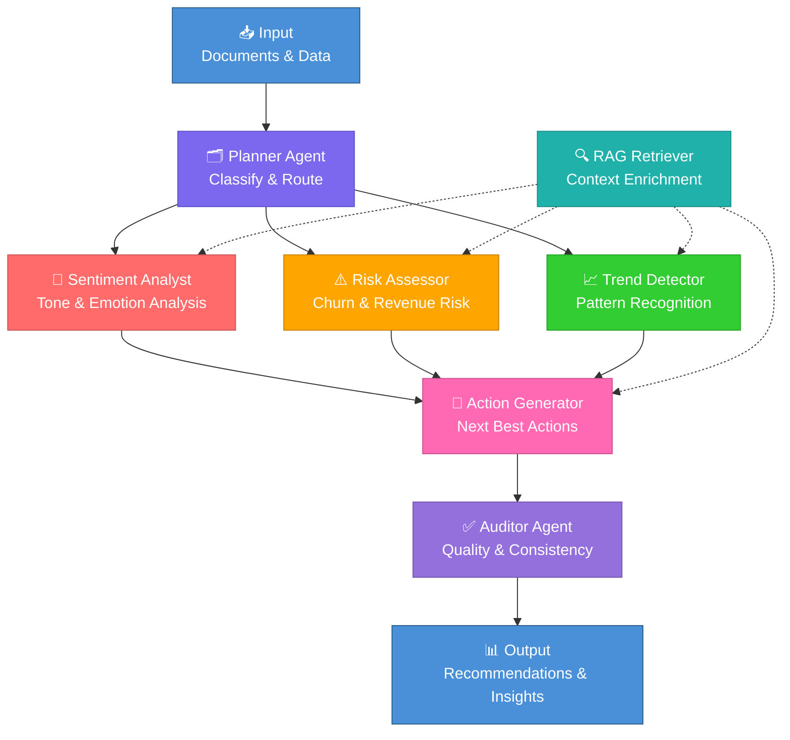

<p align="center">
  <h1 align="center">🔮 InsightForge AI</h1>
  <h3 align="center">Agentic Next Best Action Intelligence Platform</h3>
  <p align="center">
    <em>Transform raw customer signals into audited, memory-augmented executive decisions</em>
  </p>
  <p align="center">
    
    
    
    
    
    
  </p>
</p>

---


## 🎯 The Problem

Customer Success teams are **drowning in signals** — meeting notes, CRM exports, support tickets, usage telemetry — but lack the tools to synthesize them into **actionable intelligence** in real time. Traditional dashboards show *what happened*; InsightForge AI tells you *what to do next and why*.

**InsightForge AI** is an agentic intelligence platform powered by a 7-agent LangGraph pipeline that ingests multi-format customer data, performs deep analysis across sentiment, risk, and trends, and produces audited **Next Best Action** recommendations with full reasoning traces.

> **Built for the Google AI Hackathon** — demonstrating production-grade agentic AI with Gemini 2.5 Flash, RAG retrieval, and multi-agent orchestration.

---

## ✨ Key Features

- 🤖 **7-Agent LangGraph Pipeline** — Specialized agents for planning, sentiment analysis, risk scoring, trend detection, RAG retrieval, action generation, and quality auditing
- 📄 **Multi-Format Ingestion** — Upload meeting notes (TXT), CRM exports (CSV), support tickets, PDFs, and DOCX files
- 🧠 **RAG-Powered Memory** — FAISS vector store with sentence-transformer embeddings for contextual retrieval across all customer history
- 📊 **Interactive Analytics Dashboard** — Real-time Plotly visualizations of sentiment trends, risk scores, and engagement metrics
- 🎯 **Next Best Action Engine** — Prioritized, actionable recommendations with confidence scores and business impact estimates
- 🔍 **Full Reasoning Traces** — Every recommendation includes the complete agent pipeline execution for auditability
- 🐳 **Docker-Ready** — One-command deployment with Docker Compose
- 🌐 **REST API** — Full FastAPI backend with OpenAPI documentation
- 💡 **Demo Mode** — Built-in sample data for instant exploration without API keys

---

## 🏗️ Architecture

### High-Level System Overview

```
┌─────────────────────────────────────────────────────────────────────┐
│                        STREAMLIT FRONTEND                          │
│  ┌──────────┐  ┌───────────────┐  ┌──────────┐  ┌──────────────┐  │
│  │ Document  │  │   Analysis    │  │  Agent   │  │  Knowledge   │  │
│  │  Upload   │  │  Dashboard    │  │  Trace   │  │    Base      │  │
│  └────┬─────┘  └───────┬───────┘  └────┬─────┘  └──────┬───────┘  │
│       │                │               │               │           │
└───────┼────────────────┼───────────────┼───────────────┼───────────┘
        │                │               │               │
        ▼                ▼               ▼               ▼
┌─────────────────────────────────────────────────────────────────────┐
│                      FASTAPI BACKEND (REST API)                    │
│  ┌──────────────┐  ┌──────────────┐  ┌──────────────────────────┐  │
│  │  /api/upload  │  │ /api/analyze │  │  /api/knowledge/search   │  │
│  └──────┬───────┘  └──────┬───────┘  └────────────┬─────────────┘  │
│         │                 │                        │                │
│         ▼                 ▼                        ▼                │
│  ┌──────────────────────────────────────────────────────────────┐   │
│  │                  LANGGRAPH ORCHESTRATOR                      │   │
│  │                                                              │   │
│  │  ┌─────────┐    ┌───────────┐    ┌──────────┐              │   │
│  │  │ PLANNER │───▶│ SENTIMENT │───▶│   RISK   │              │   │
│  │  │  Agent  │    │  ANALYST  │    │ ASSESSOR │              │   │
│  │  └─────────┘    └───────────┘    └────┬─────┘              │   │
│  │                                       │                     │   │
│  │  ┌─────────┐    ┌───────────┐    ┌────▼─────┐              │   │
│  │  │ AUDITOR │◀───│   ACTION  │◀───│  TREND   │              │   │
│  │  │  Agent  │    │ GENERATOR │    │ DETECTOR │              │   │
│  │  └────┬────┘    └───────────┘    └──────────┘              │   │
│  │       │                                                     │   │
│  │       ▼                                                     │   │
│  │  ┌──────────────────────────────────────────┐              │   │
│  │  │          RAG RETRIEVER AGENT              │              │   │
│  │  │    (Available to all agents on demand)    │              │   │
│  │  └──────────────────────────────────────────┘              │   │
│  └──────────────────────────────────────────────────────────────┘   │
│                                                                     │
│  ┌──────────────┐  ┌──────────────┐  ┌──────────────────────────┐  │
│  │   SQLite DB   │  │  FAISS Index │  │  Sentence Transformers   │  │
│  │  (History)    │  │  (Vectors)   │  │    (Embeddings)          │  │
│  └──────────────┘  └──────────────┘  └──────────────────────────┘  │
└─────────────────────────────────────────────────────────────────────┘
```

### Agent Pipeline Flow (Mermaid)



---

## 🛠️ Technology Stack

| Layer | Technology | Purpose |
|-------|-----------|---------|
| **Frontend** | Streamlit 1.40+ | Interactive dashboard & document upload |
| **Visualization** | Plotly 5.24+ | Dynamic charts & analytics |
| **Backend API** | FastAPI 0.115+ | REST API with async support |
| **Orchestration** | LangGraph 0.2.50+ | Multi-agent pipeline coordination |
| **LLM** | Google Gemini 2.5 Flash | Natural language understanding & generation |
| **Embeddings** | Sentence-Transformers | Document vectorization (all-MiniLM-L6-v2) |
| **Vector Store** | FAISS | Similarity search & RAG retrieval |
| **Database** | SQLite + aiosqlite | Analysis history & metadata storage |
| **Document Processing** | PyPDF2, docx2txt | Multi-format document parsing |
| **Containerization** | Docker & Docker Compose | Production deployment |

---

## 🚀 Quick Start — Local

### Prerequisites

- Python 3.11+
- Google Gemini API Key ([Get one free](https://aistudio.google.com/apikey))

### Installation

```bash
# 1. Clone the repository
git clone https://github.com/your-org/insightforge-ai.git
cd insightforge-ai

# 2. Create virtual environment
python -m venv venv
source venv/bin/activate    # Linux/Mac
venv\Scripts\activate       # Windows

# 3. Install dependencies
pip install -r requirements.txt

# 4. Configure environment
cp .env.example .env
# Edit .env and add your GOOGLE_API_KEY

# 5. Start the backend
uvicorn backend.main:app --reload --port 8000

# 6. Start the frontend (new terminal)
streamlit run frontend/app.py --server.port 8501
```

### Access

| Service | URL |
|---------|-----|
| 🖥️ **Dashboard** | [http://localhost:8501](http://localhost:8501) |
| 📡 **API Docs** | [http://localhost:8000/docs](http://localhost:8000/docs) |
| ❤️ **Health Check** | [http://localhost:8000/api/health](http://localhost:8000/api/health) |

---

## 🐳 Quick Start — Docker

```bash
# 1. Configure environment
cp .env.example .env
# Edit .env and add your GOOGLE_API_KEY

# 2. Build and run
docker-compose up --build

# Or run with single container
docker build -t insightforge-ai .
docker run -p 8000:8000 -p 8501:8501 --env-file .env insightforge-ai
```

---

## 🎮 Demo Walkthrough

InsightForge AI ships with realistic demo data so you can explore immediately — **no API key required** in demo mode.

### Step 1: Launch & Navigate
Open the Streamlit dashboard at `http://localhost:8501`. The sidebar provides navigation across all features.

### Step 2: Upload Documents
Navigate to **📄 Upload & Ingest** and upload the sample files from `data/demo/`:
- `sample_meeting_notes.txt` — Quarterly business review notes for Acme Corporation
- `sample_crm_export.csv` — 6-month CRM metrics showing declining engagement
- `sample_support_tickets.txt` — Critical open support tickets

### Step 3: Run Analysis
Go to **🔍 Analyze** and click **Run Full Analysis**. Watch the 7-agent pipeline execute in real time:
1. **Planner** classifies the input and creates an analysis plan
2. **Sentiment Analyst** detects frustration signals and declining satisfaction
3. **Risk Assessor** calculates churn probability and revenue at risk
4. **Trend Detector** identifies deteriorating engagement patterns
5. **RAG Retriever** enriches analysis with historical context
6. **Action Generator** produces prioritized recommendations
7. **Auditor** validates consistency and quality

### Step 4: Explore Results
- **📊 Dashboard** — Interactive charts showing sentiment trends, risk scores, and metrics
- **🎯 Recommendations** — Prioritized Next Best Actions with confidence scores
- **🔍 Agent Trace** — Full reasoning chain from each agent in the pipeline
- **📚 Knowledge Base** — Search across all ingested documents

### Step 5: Ask Questions
Use the **Knowledge Base** search to ask natural language questions like:
- *"What are the main complaints from Acme Corporation?"*
- *"What is the churn risk for accounts with declining NPS?"*
- *"What actions should we take before the renewal deadline?"*

---

## 📡 API Endpoints

| Method | Endpoint | Description |
|--------|----------|-------------|
| `GET` | `/api/health` | Health check with system status |
| `POST` | `/api/upload` | Upload and ingest documents (TXT, CSV, PDF, DOCX) |
| `POST` | `/api/analyze` | Run full 7-agent analysis pipeline |
| `GET` | `/api/analysis/{id}` | Retrieve analysis results by ID |
| `GET` | `/api/history` | List all past analyses |
| `POST` | `/api/knowledge/search` | Semantic search across knowledge base |
| `GET` | `/api/knowledge/stats` | Knowledge base statistics |

### Example: Run Analysis

```bash
curl -X POST http://localhost:8000/api/analyze \
  -H "Content-Type: application/json" \
  -d '{
    "input_text": "Customer reported declining usage and support frustrations",
    "customer_id": "acme-corp",
    "analysis_type": "comprehensive"
  }'
```

---

## 🤖 Agent Architecture

InsightForge AI uses a **7-agent LangGraph pipeline** where each agent is a specialized node with a distinct responsibility:

### 1. 🗂️ Planner Agent
**Role:** Intake coordinator and analysis strategist
- Classifies input data type (meeting notes, CRM data, tickets, etc.)
- Determines which analytical dimensions are relevant
- Creates a structured analysis plan for downstream agents
- Routes data to appropriate specialist agents

### 2. 💬 Sentiment Analyst
**Role:** Emotional intelligence and tone analysis
- Analyzes customer sentiment across all touchpoints
- Detects frustration signals, satisfaction indicators, and urgency markers
- Provides sentiment scores with supporting evidence
- Identifies sentiment trends over time

### 3. ⚠️ Risk Assessor
**Role:** Churn prediction and revenue risk modeling
- Calculates churn probability based on behavioral signals
- Quantifies revenue at risk (ARR impact)
- Identifies risk accelerators and mitigating factors
- Assigns risk severity levels (Critical / High / Medium / Low)

### 4. 📈 Trend Detector
**Role:** Pattern recognition across temporal data
- Identifies engagement trends (improving / stable / declining)
- Detects anomalies in usage, support, and satisfaction metrics
- Provides trend velocity and acceleration analysis
- Forecasts future trajectory based on current patterns

### 5. 🔍 RAG Retriever
**Role:** Context enrichment via semantic search
- Queries FAISS vector store for relevant historical context
- Enriches analysis with prior interactions and decisions
- Provides supporting evidence for agent conclusions
- Available on-demand to all other agents in the pipeline

### 6. 🎯 Action Generator
**Role:** Strategic recommendation engine
- Synthesizes insights from all upstream agents
- Generates prioritized Next Best Actions
- Assigns confidence scores and business impact estimates
- Provides implementation timelines and ownership suggestions

### 7. ✅ Auditor Agent
**Role:** Quality assurance and consistency validation
- Reviews the complete analysis for logical consistency
- Validates that recommendations are supported by evidence
- Checks for contradictions between agent outputs
- Assigns an overall confidence grade to the final output

---

## 📁 Project Structure

```
insightforge-ai/
├── backend/
│   ├── __init__.py
│   ├── main.py                 # FastAPI application entry point
│   ├── config.py               # Settings & environment configuration
│   ├── models/
│   │   ├── __init__.py
│   │   └── schemas.py          # Pydantic request/response models
│   ├── services/
│   │   ├── __init__.py
│   │   ├── document_processor.py  # Multi-format document ingestion
│   │   ├── vector_store.py     # FAISS index management
│   │   └── database.py         # SQLite async operations
│   └── agents/
│       ├── __init__.py
│       ├── state.py            # LangGraph shared state definition
│       ├── graph.py            # LangGraph pipeline orchestration
│       ├── planner.py          # Planner agent node
│       ├── sentiment.py        # Sentiment analyst node
│       ├── risk.py             # Risk assessor node
│       ├── trend.py            # Trend detector node
│       ├── rag.py              # RAG retriever node
│       ├── action.py           # Action generator node
│       └── auditor.py          # Auditor agent node
├── frontend/
│   ├── app.py                  # Streamlit main application
│   └── components/
│       ├── __init__.py
│       ├── sidebar.py          # Navigation sidebar
│       ├── upload.py           # Document upload interface
│       ├── dashboard.py        # Analytics dashboard
│       └── analysis.py         # Analysis results display
├── data/
│   ├── demo/                   # Sample data for demo mode
│   │   ├── sample_meeting_notes.txt
│   │   ├── sample_crm_export.csv
│   │   └── sample_support_tickets.txt
│   ├── db/                     # SQLite database
│   ├── faiss/                  # FAISS vector index
│   └── uploads/                # Uploaded documents
├── tests/
│   ├── __init__.py
│   └── test_health.py          # Health check tests
├── .env.example                # Environment template
├── requirements.txt            # Python dependencies
├── Dockerfile                  # Container definition
├── docker-compose.yml          # Multi-service orchestration
├── start.sh                    # Container entrypoint
└── README.md                   # This file
```

---

## ⚙️ Configuration

All configuration is managed through environment variables. Copy `.env.example` to `.env` and customize:

| Variable | Default | Description |
|----------|---------|-------------|
| `GOOGLE_API_KEY` | *(required)* | Google Gemini API key for LLM inference |
| `BACKEND_URL` | `http://localhost:8000` | Backend API base URL |
| `LOG_LEVEL` | `INFO` | Logging verbosity (DEBUG, INFO, WARNING, ERROR) |
| `EMBEDDING_MODEL` | `all-MiniLM-L6-v2` | Sentence-transformer model for embeddings |
| `LLM_MODEL` | `gemini-2.5-flash` | Gemini model for agent reasoning |
| `DB_PATH` | `data/db/insightforge.db` | SQLite database file path |
| `FAISS_INDEX_PATH` | `data/faiss/index.faiss` | FAISS vector index file path |
| `FAISS_METADATA_DB` | `data/faiss/metadata.sqlite` | FAISS metadata database path |
| `UPLOAD_DIR` | `data/uploads` | Directory for uploaded documents |

---

## 🤝 Contributing

We welcome contributions! Here's how to get started:

1. **Fork** the repository
2. **Create** a feature branch (`git checkout -b feature/amazing-feature`)
3. **Commit** your changes (`git commit -m 'Add amazing feature'`)
4. **Push** to the branch (`git push origin feature/amazing-feature`)
5. **Open** a Pull Request

### Development Guidelines

- Follow PEP 8 style guidelines
- Add type hints to all function signatures
- Write docstrings for all public functions and classes
- Include unit tests for new features
- Update documentation as needed

### Running Tests

```bash
# Run all tests
python -m pytest tests/ -v

# Run with coverage
python -m pytest tests/ --cov=backend --cov-report=html
```

---

## 📄 License

This project is licensed under the **MIT License** — see the [LICENSE](LICENSE) file for details.

---

<p align="center">
  <strong>Built with ❤️ for the Google AI Hackathon</strong><br>
  <em>Powered by Gemini 2.5 Flash • LangGraph • FastAPI • Streamlit</em>
</p>
